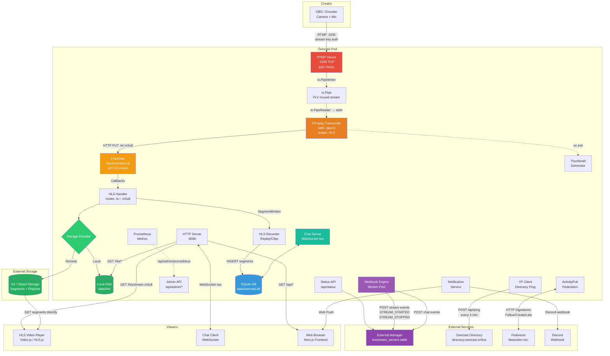

# Livestream Architecture

## End-to-End Flow

```
┌──────────────────────────────────────────────────────────────────────────────────────────────┐
│                                        CREATOR SIDE                                          │
│                                                                                              │
│   ┌──────────┐    RTMP     ┌──────────────────────────────────────────────┐                  │
│   │  Camera/  │───────────►│              OWNCAST POD                     │                  │
│   │  OBS /    │  :1935     │                                              │                  │
│   │  Encoder  │  (TCP)     │  ┌────────────┐    io.Pipe    ┌──────────┐  │                  │
│   └──────────┘  stream key │  │ RTMP Server ├─────────────►│  FFmpeg  │  │                  │
│                  in URL     │  │ (joy5 lib)  │  FLV muxed   │Transcoder│  │                  │
│                  path:      │  │             │  audio+video  │          │  │                  │
│                  /live/KEY  │  └────────────┘               └────┬─────┘  │                  │
│                             │                                    │        │                  │
│                             │                          HTTP PUT  │        │                  │
│                             │                       .ts segments │        │                  │
│                             │                      .m3u8 playlists       │                  │
│                             │                                    ▼        │                  │
│                             │                    ┌───────────────────┐    │                  │
│                             │                    │ FileWriter        │    │                  │
│                             │                    │ ReceiverService   │    │                  │
│                             │                    │ (127.0.0.1:auto)  │    │                  │
│                             │                    └─────────┬─────────┘    │                  │
│                             │                              │              │                  │
│                             │                    ┌─────────▼─────────┐    │                  │
│                             │                    │    HLS Handler    │    │                  │
│                             │                    │  (route by ext)   │    │                  │
│                             │                    └──┬──────┬──────┬──┘    │                  │
│                             │                       │      │      │       │                  │
│                             │              .ts ─────┘  .m3u8     stream.m3u8                 │
│                             │              segments  variant pl  master pl                   │
│                             │                       │      │      │       │                  │
│                             │                    ┌──▼──────▼──────▼──┐    │                  │
│                             │                    │  Storage Provider │    │                  │
│                             │                    │  (Local or S3)    │    │                  │
│                             │                    └──┬───────────┬────┘    │                  │
│                             │                       │           │         │                  │
│                             │                       ▼           ▼         │                  │
│                             │               ┌───────────┐ ┌─────────┐    │                  │
│                             │               │ data/hls/ │ │   S3    │    │                  │
│                             │               │ (local)   │ │ Bucket  │    │                  │
│                             │               └─────┬─────┘ └────┬────┘    │                  │
│                             │                     │            │         │                  │
│                             └─────────────────────┼────────────┼─────────┘                  │
│                                                   │            │                            │
└───────────────────────────────────────────────────┼────────────┼────────────────────────────┘
                                                    │            │
                                                    ▼            ▼
┌──────────────────────────────────────────────────────────────────────────────────────────────┐
│                                        VIEWER SIDE                                           │
│                                                                                              │
│   ┌──────────┐  GET /hls/stream.m3u8   ┌──────────────────┐                                 │
│   │  Video   │◄────────────────────────│  Owncast HTTP    │   If S3: master playlist from   │
│   │  Player  │  GET /hls/{id}/{v}/*.ts │  Server :8080    │   Owncast, segments from S3     │
│   │ (HLS.js/ │◄────────────────────────│                  │   CDN endpoint directly          │
│   │ Video.js)│                         └──────────────────┘                                 │
│   └──────────┘                                                                              │
│                                                                                              │
│   ┌──────────┐  WebSocket /ws           ┌──────────────────┐                                │
│   │   Chat   │◄────────────────────────►│  Chat Server     │                                │
│   │  Client  │  accessToken auth        │  (gorilla/ws)    │                                │
│   └──────────┘                          └──────────────────┘                                │
│                                                                                              │
│   ┌──────────┐  GET /api/status         ┌──────────────────┐                                │
│   │   Web    │◄────────────────────────│  REST API        │                                │
│   │   App    │  GET /api/config         │  Controllers     │                                │
│   │(Next.js) │  POST /api/chat/register │                  │                                │
│   └──────────┘                          └──────────────────┘                                │
│                                                                                              │
└──────────────────────────────────────────────────────────────────────────────────────────────┘
```

## Component Diagram (Mermaid)



## Detailed Data Flow

### 1. Stream Ingest (Creator → Owncast)

```
Creator's OBS/Encoder
    │
    │  RTMP over TCP, port 1935
    │  URL: rtmp://server:1935/live/STREAM_KEY
    │
    ▼
┌─────────────────────────────────────────────┐
│  RTMP Server  (core/rtmp/rtmp.go)           │
│                                             │
│  1. Accept TCP connection                   │
│  2. Reject if stream already connected      │
│     (_hasInboundRTMPConnection flag)        │
│  3. Validate stream key from URL path       │
│     (/live/{key} vs data.GetStreamKeys())   │
│  4. Create io.Pipe()                        │
│  5. Call setStreamAsConnected(pipeReader)    │
│  6. Read RTMP packets in loop               │
│     - 10 second read deadline               │
│     - EOF / timeout / error → disconnect    │
│  7. Mux packets to FLV via io.PipeWriter    │
│                                             │
│  Disconnect triggers:                       │
│  - io.EOF (broadcaster stopped)             │
│  - Read timeout (10s, network issue)        │
│  - Write error (pipe closed)               │
│  All → handleDisconnect() → pipe.Close()    │
└─────────────────────────────────────────────┘
```

### 2. Transcoding (RTMP → HLS)

```
┌─────────────────────────────────────────────┐
│  setStreamAsConnected()                     │
│  (core/streamState.go)                      │
│                                             │
│  1. Generate unique streamId (shortid)      │
│  2. Set _stats.StreamConnected = true       │
│  3. Create _currentBroadcast record         │
│  4. Setup storage provider                  │
│  5. Setup video components                  │
│  6. Launch transcoder in goroutine          │
│  7. Send STREAM_STARTED webhook             │
│  8. Start thumbnail generator               │
│  9. Send chat "stream is starting"          │
│  10. Schedule federated "Go Live" (2 min)   │
└───────────────────┬─────────────────────────┘
                    │
                    ▼
┌─────────────────────────────────────────────┐
│  FFmpeg Transcoder                          │
│  (core/transcoder/transcoder.go)            │
│                                             │
│  Command:                                   │
│    ffmpeg -i pipe:0                         │
│      -c:v:{n} {codec} -b:v:{n} {bitrate}   │
│      ... (per variant)                      │
│      -f hls                                 │
│      -hls_time {seconds_per_segment}        │
│      -hls_list_size {segment_count}         │
│      -hls_flags omit_endlist+...            │
│      -method PUT                            │
│      -hls_segment_filename                  │
│        http://127.0.0.1:{port}/{id}/%v/...  │
│      http://127.0.0.1:{port}/{id}/%v/...    │
│                                             │
│  Codecs: libx264, h264_nvenc, h264_vaapi,   │
│          h264_videotoolbox, h264_omx        │
│                                             │
│  On exit → TranscoderCompleted callback     │
│         → SetStreamAsDisconnected()         │
└─────────────────────────────────────────────┘
```

### 3. Segment Processing (FFmpeg → Storage)

```
┌─────────────────────────────────────────────┐
│  FileWriterReceiverService                  │
│  (core/transcoder/fileWriterReceiverService)│
│                                             │
│  Internal HTTP server at 127.0.0.1:{auto}   │
│  Accepts PUT from FFmpeg:                   │
│                                             │
│  PUT /{streamId}/{variant}/stream-{n}.ts    │
│       → write to data/hls/...              │
│       → callback: SegmentWritten            │
│                                             │
│  PUT /{streamId}/{variant}/stream.m3u8      │
│       → write to data/hls/...              │
│       → callback: VariantPlaylistWritten    │
│                                             │
│  PUT /{streamId}/stream.m3u8               │
│       → write to data/hls/...              │
│       → callback: MasterPlaylistWritten     │
└───────────────────┬─────────────────────────┘
                    │
                    ▼
┌─────────────────────────────────────────────┐
│  HLS Handler                                │
│  (core/transcoder/hlsHandler.go)            │
│                                             │
│  SegmentWritten:                            │
│    → Storage.SegmentWritten (upload/move)    │
│    → HLSRecorder.SegmentWritten (DB insert) │
│                                             │
│  VariantPlaylistWritten:                    │
│    → Storage.VariantPlaylistWritten          │
│                                             │
│  MasterPlaylistWritten:                     │
│    → Storage.MasterPlaylistWritten           │
│    → Rewrite playlist (relative/S3 URLs)    │
└───────────────────┬─────────────────────────┘
                    │
            ┌───────┴───────┐
            ▼               ▼
    ┌──────────────┐ ┌──────────────┐
    │ Local Disk   │ │ S3 Upload    │
    │ data/hls/    │ │ (4 retries,  │
    │              │ │  10s timeout) │
    └──────┬───────┘ └──────┬───────┘
           │                │
           ▼                ▼
    Served via          Served via
    GET /hls/*          S3/CDN endpoint
    on :8080            (segments only;
                        master from :8080)
```

### 4. Viewer Playback

```
┌─────────────────────────────────────────────┐
│  Viewer's Browser                           │
│                                             │
│  1. Load page: GET /                        │
│     → Next.js SPA with OwncastPlayer        │
│                                             │
│  2. Player requests: GET /api/status         │
│     → { online: true/false, viewerCount }   │
│                                             │
│  3. If online, player fetches:               │
│     GET /hls/stream.m3u8 (master playlist)  │
│       → lists variant playlists              │
│                                             │
│  4. Player selects variant:                  │
│     GET /hls/{streamId}/{v}/stream.m3u8     │
│       → lists .ts segment URLs               │
│                                             │
│  5. Player fetches segments:                 │
│     GET /hls/{streamId}/{v}/stream-{n}.ts   │
│       (or from S3 if remote storage)        │
│                                             │
│  6. Player polls variant playlist for new    │
│     segments (HLS live — no #EXT-X-ENDLIST) │
│                                             │
│  7. Ping: POST /api/ping every few seconds   │
│     → core.SetViewerActive()                │
│     → viewer counted in stats               │
└─────────────────────────────────────────────┘
```

### 5. Stream Disconnect Flow

```
Creator stops streaming (or network failure)
    │
    ▼
RTMP: EOF / timeout / error
    │
    ▼
handleDisconnect() → pipe.Close()
    │
    ▼
FFmpeg stdin gets EOF → FFmpeg exits
    │
    ▼
_commandExec.Wait() returns
    │
    ▼
TranscoderCompleted callback fires
    │
    ▼
SetStreamAsDisconnected()
    ├── Send chat: "The stream is ending"
    ├── Set _stats.StreamConnected = false
    ├── handler.StreamEnded() → DB: set end_time
    ├── Stop thumbnail generator
    ├── rtmp.Disconnect()
    ├── Send STREAM_STOPPED webhook ──────► External Manager
    ├── Append offline.ts to playlists
    ├── Upload offline playlists to storage
    ├── Start 5-min offline cleanup timer
    └── Save stats to DB
            │
            ▼ (after 5 minutes)
    resetDirectories() + transitionToOfflineVideoStreamContent()
    → Clean HLS dir, start offline transcoder
```

### 6. External Manager Integration

```
┌─────────────────────────────────────────────┐
│  Owncast → External Manager                 │
│                                             │
│  Webhooks (HTTP POST):                      │
│  ┌─────────────────────────────────────┐    │
│  │ STREAM_STARTED                      │    │
│  │ { type, eventData: {               │    │
│  │     streamID, name, summary,       │    │
│  │     streamTitle, status, timestamp  │    │
│  │ }}                                  │    │
│  └─────────────────────────────────────┘    │
│  ┌─────────────────────────────────────┐    │
│  │ STREAM_STOPPED                      │    │
│  │ { type, eventData: { ... } }       │    │
│  └─────────────────────────────────────┘    │
│                                             │
│  Status API (HTTP GET):                     │
│  ┌─────────────────────────────────────┐    │
│  │ GET /api/status                     │    │
│  │ → { online: bool, viewerCount,     │    │
│  │     lastConnectTime,                │    │
│  │     lastDisconnectTime }            │    │
│  └─────────────────────────────────────┘    │
│                                             │
│  Admin API (HTTP GET, admin auth):          │
│  ┌─────────────────────────────────────┐    │
│  │ GET /api/admin/status               │    │
│  │ → { broadcaster, currentBroadcast,  │    │
│  │     online, health, viewerCount }   │    │
│  └─────────────────────────────────────┘    │
└─────────────────────────────────────────────┘
```

## Port Summary

| Port | Protocol | Purpose |
|------|----------|---------|
| **1935** | RTMP/TCP | Inbound stream from creator's encoder |
| **8080** | HTTP | Web UI, HLS delivery, REST API, WebSocket chat, Admin |
| **auto** | HTTP (localhost only) | Internal: FFmpeg → FileWriterReceiverService |

## Database Tables

| Table | Purpose |
|-------|---------|
| `streams` | Stream session metadata (id, title, start/end time) |
| `video_segments` | HLS segment paths and timestamps for replays |
| `video_segment_output_configuration` | Output variant configs per stream |
| `replay_clips` | User-created clip definitions |
| `messages` | Chat message history |
| `users` | Chat users (display name, color, auth) |
| `user_access_tokens` | Token → user mapping |
| `auth` | External auth (IndieAuth, Fediverse) |
| `notifications` | Push notification subscriptions |
| `ip_bans` | Banned IP addresses |
| `ap_followers` | ActivityPub followers |
| `ap_outbox` | ActivityPub outbox (sent activities) |
| `ap_accepted_activities` | Processed inbound activities |

## Key Files

| Component | Primary File(s) |
|-----------|----------------|
| Entry point | `main.go` |
| Core init | `core/core.go` |
| RTMP server | `core/rtmp/rtmp.go` |
| Stream lifecycle | `core/streamState.go` |
| Transcoder | `core/transcoder/transcoder.go` |
| FFmpeg→Owncast bridge | `core/transcoder/fileWriterReceiverService.go` |
| HLS routing | `core/transcoder/hlsHandler.go` |
| Local storage | `core/storageproviders/local.go` |
| S3 storage | `core/storageproviders/s3Storage.go` |
| Offline state | `core/offlineState.go` |
| Status API | `core/status.go`, `controllers/status.go` |
| Webhooks | `core/webhooks/stream.go`, `core/webhooks/webhooks.go` |
| Chat | `core/chat/server.go` |
| Replay recording | `replays/hlsRecorder.go` |
| HTTP router | `router/router.go` |
| Config | `config/config.go`, `config/defaults.go` |
| DB schema | `db/schema.sql`, `db/query.sql` |
